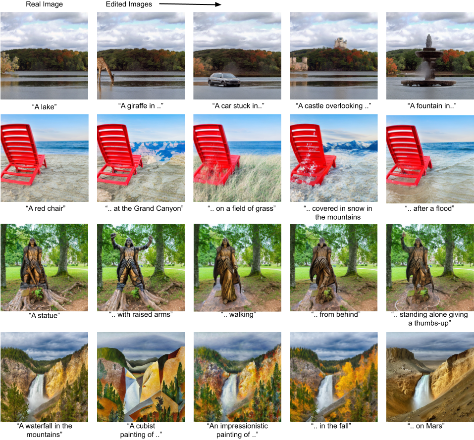

# Official Implementation of EDICT: Exact Diffusion Inversion via Coupled Transformations

[Arxiv](https://arxiv.org/abs/2211.12446)

# What is EDICT?

EDICT (Exact Diffusion Inversion via Coupled Transformations) is an algorithm that closely mirrors a typical generative diffusion process but in an invertible fashion. We achieve this by tracking a *pair* of intermediate representations instead of just one. This exact invertibility enables edits that remain extremely faithful to the original image. Check out our [paper](https://arxiv.org/abs/2211.12446) for more details and don't hesitate to reach out with questions!


# Setup

## HF Auth token

Paste a copy of a suitable [HF Auth Token](https://huggingface.co/docs/hub/security-tokens) into [hf_auth](hf_auth) with no new line (to be read by the following code in `edict_functions.py`)
```
with open('hf_auth', 'r') as f:
    auth_token = f.readlines()[0].strip()
    
```

Example file at `./hf_auth`
```
abc123abc123
```

## Environment

Run  `conda env create -f environment.yaml`, activate that conda env (`conda activate edict`). Run jupyter with that conda env active

# Experimentation

Check out [this notebook](usage.ipynb) for examples of how to use EDICT; including edits on randomly selected in-the-wild imagery.

# Example Results

## Changing Dog Breeds


## Miscellaneous





# Citation

If you find our work useful in your research, please cite:

```
@article{wallace2022edict,
  title={EDICT: Exact Diffusion Inversion via Coupled Transformations},
  author={Wallace, Bram and Gokul, Akash and Naik, Nikhil},
  journal={arXiv preprint arXiv:2211.12446},
  year={2022}
}
```

# License

Our code is BSD-3 licensed. See LICENSE.txt for details.

